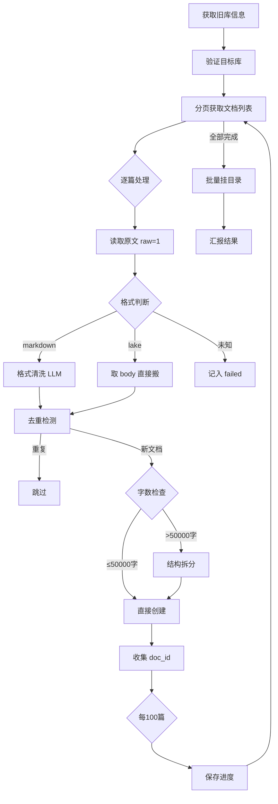

# 语雀知识库迁移 Skill

> 将语雀知识库内容复制整理到另一个知识库 —— 清洗格式、去重、拆大文档、批量挂目录、断点续传。

**核心理念：复制不搬。原库完全不动，目标库接收清洗后的内容。**

---

## 功能特性

| 功能 | 说明 |
|------|------|
| 🔄 **跨库复制** | 将源知识库的全部文档复制到目标知识库，源库毫发无伤 |
| 🧹 **格式清洗** | LLM 驱动的文档清洗：去广告、清 HTML 残留、修复 Markdown 格式 |
| 🔍 **智能去重** | 按标题搜索 → 逐级内容比对 → 自动跳过重复文档 |
| ✂️ **大文档拆分** | >50000 字（约 200KB）的文档自动按结构拆分，保持代码块完整性 |
| 🗑️ **二进制过滤** | 内容采样自动检测并跳过二进制文件（图片/压缩包等） |
| 📂 **目录组织** | 按主题自动分类、层级建目录、批量挂文档 |
| 💾 **断点续传** | 进度文件持久化，中断后精确接续 |
| 🏷️ **格式兼容** | 支持 Markdown 和 Lake 格式（自动转为 Markdown） |
| 🚦 **限流保护** | 自动检测 Rate Limit，触发限流后保存进度等恢复 |
| 📊 **容量检查** | 目标库达 5000 篇上限自动暂停，通知用户更换 |

---

## 快速开始

### 前置条件

1. **语雀 Token**：在 `utils/yuque/yuque-ai/yuque-config.json` 中配置
2. **源知识库和目标知识库**：需已在语雀中创建

```json
{
  "token": "your_yuque_token",
  "group": "your_login_name"
}
```

### 使用方式

在 OpenClaw 中直接对话：

```
将《废弃0》内容整理到《废弃19》
```

中断后继续：

```
继续整理《废弃0》
```

---

## 迁移流程



---

## 文档格式处理

### Markdown 格式

完整走清洗流程：
- 删除广告横幅、纯表情/灌水评论
- 清除 HTML 注释和废弃标签
- 修复断裂的 Markdown 格式、中文全角标点混用
- 保留技术内容、转载标记、有实质讨论的评论
- 不改动标题层级、代码块、表格

### Lake 格式（新增）

语雀新版编辑器格式。处理方式：
- 直接取 `body` 字段（已是 Markdown 链接文本）
- **不做格式清洗**，标题 + 链接原样保留
- 标记为 "lake 格式已转为 markdown"

### 二进制文件

通过内容采样检测（非 ASCII + 控制字符 > 25%），判定为二进制则直接跳过，不记入失败。

### 未知格式

直接记入 `failed`，不阻塞整体流程。

---

## API 接口

基地址：`https://www.yuque.com/api/v2`

| 操作 | 方法 | 路径 |
|------|------|------|
| 获取知识库列表 | `GET` | `/users/{login}/repos` |
| 获取知识库详情 | `GET` | `/repos/{book_id}` |
| 分页获取文档 | `GET` | `/repos/{book_id}/docs?offset={N}&limit=100` |
| 读取文档原文 | `GET` | `/repos/{book_id}/docs/{doc_id}?raw=1` |
| 搜索文档 | `GET` | `/search?q={title}&type=doc&scope={namespace}` |
| 创建文档 | `POST` | `/repos/{book_id}/docs` |
| 创建目录节点 | `PUT` | `/repos/{book_id}/toc` |

---

## 限流与容错

### Rate Limit
- **5000 次/小时** → 触发后保存进度，等整点恢复
- **100 次/秒** → 等 1s 重试，最多 3 次
- 每次请求自动检查 `X-RateLimit-Remaining`

### 错误重试
- 网络超时 / 5xx / 4xx（非 404）→ 等 1s 重试，最多 3 次
- 404 → 直接跳过，标记空文档
- 3 次全部失败 → 记入 `failed` 列表

### 并发控制
- 同时处理 ≤ 5 篇文档
- 累计正文 > 5MB → 暂停新请求
- 单篇 > 10 万字 → 串行处理

---

## 进度文件

路径：`progress/{源库名}.json`

```json
{
  "source_book_id": 123,
  "target_book_id": 456,
  "last_offset": 150,
  "total_docs": 300,
  "created": 280,
  "skipped": 10,
  "failed": 5,
  "failed_list": [
    {"id": 999, "title": "xxx", "reason": "未知格式: lake"}
  ],
  "orphans": [
    {"doc_id": 888, "title": "yyy", "errors": ["TOC挂载失败"]}
  ]
}
```

---

## 迁移报告示例

```
📦 《废弃0》(5200篇) → 废弃19/
   ├─ 复制: 5145 篇
   ├─ 跳过: 0 篇（去重）50 篇（空文档）0 篇（二进制）
   ├─ 大文档: 23 篇（已拆分）
   ├─ 含附件文档: 12 篇（清单，附件无法迁移，请手动处理）
   ├─ 失败: 5 篇（清单）
   ├─ 孤儿文档: 3 篇（已创建但未挂目录，需手动处理）
   └─ 原库: 未动
```

---

## 不做什么

- ❌ 不删除原库任何内容
- ❌ 不迁移附件（API 不支持，列清单）
- ❌ 不建立分类库
- ❌ 不构建索引
- ❌ 不将源库分散到多个目标库

---

## 项目结构

```
yuque-migration/
├── SKILL.md              # Skill 定义与完整流程文档
├── progress/             # 进度文件（.gitignore 排除）
└── README.md             # 本文件
```

---

## License

MIT
