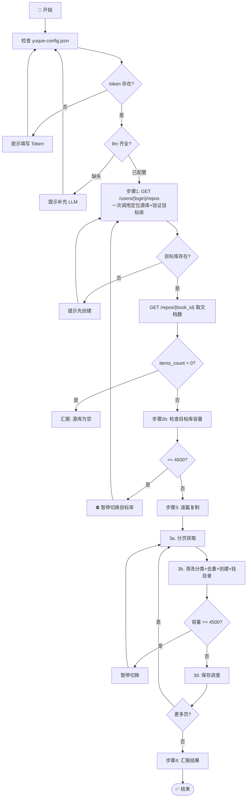
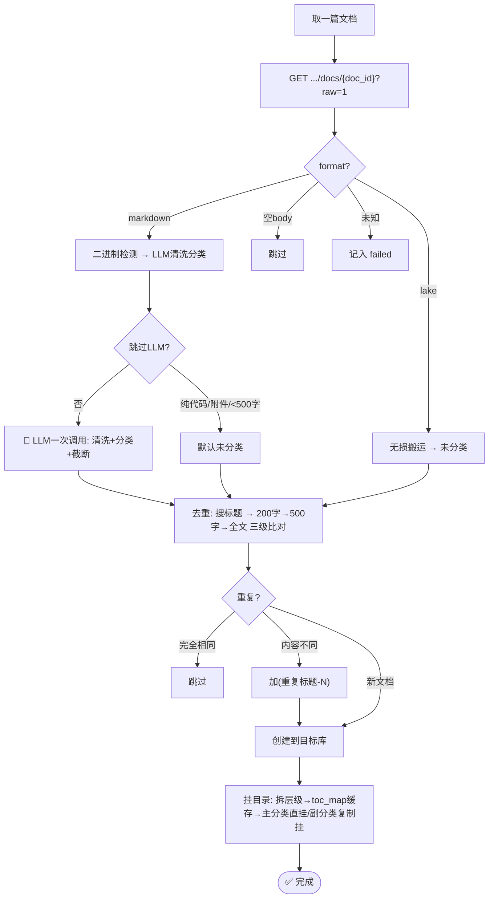
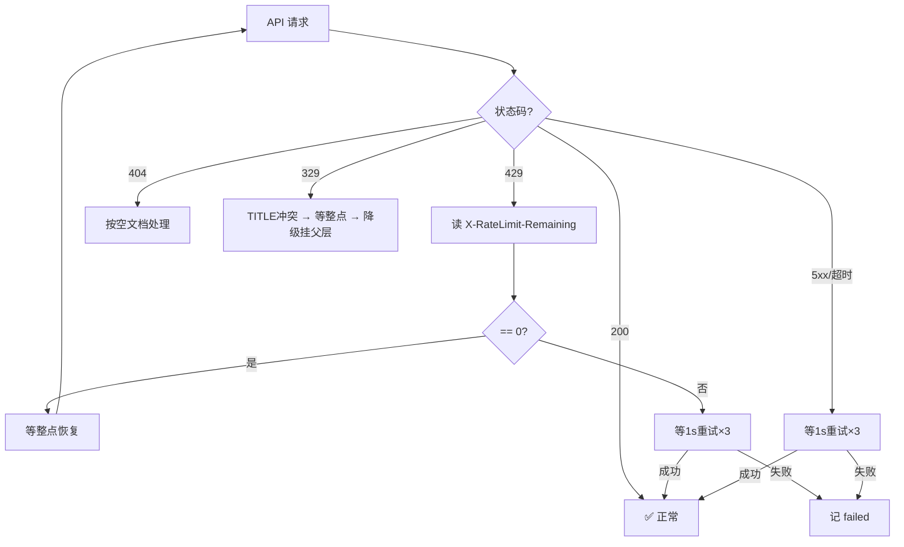
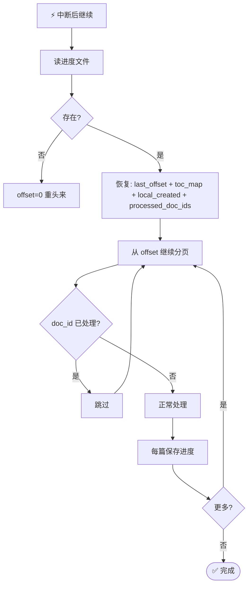

# 语雀知识库迁移 Skill

> 将语雀知识库内容复制整理到另一个知识库 —— 清洗+分类合并、去重、长文档截断、逐篇挂目录、断点续传。

**核心理念：复制不搬。原库完全不动。**

[](https://github.com/yehuoshun/yuque-migration-skill/releases)
[](./LICENSE)
[](https://www.python.org/)

## 目录

- [功能特性](#功能特性)
- [前置条件](#前置条件)
- [快速开始](#快速开始)
- [配置说明](#配置说明)
- [使用方式](#使用方式)
- [项目结构](#项目结构)
- [迁移流程](#迁移流程)
  - [主流程](#主流程)
  - [逐篇文档处理](#逐篇文档处理)
  - [限流与容错](#限流与容错)
  - [续传](#续传)
- [API 参考](#api-参考)
- [License](#license)

## 功能特性

| 功能 | 说明 |
|------|------|
| 🔄 **跨库复制** | 源库毫发无伤，目标库接收清洗后的内容 |
| 🧹 **清洗+分类合并** | 一次 LLM 调用完成格式清洗和内容分类 |
| ✂️ **长文档截断** | 超过 20000 字符由 LLM 判断自然截断点 |
| 📂 **逐篇挂目录** | 创建即分类即挂载，不攒到后置阶段 |
| 📋 **多分类复制** | 文档跨越多个分类时自动复制副本 |
| 🧠 **智能跳过** | 自动识别纯代码/附件/二进制文档，不浪费 LLM 调用 |
| 💾 **断点续传** | `toc_map` 保留已建目录，续传直接复用，中断不怕 |
| 🚦 **限流保护** | 429 → 检查 `X-RateLimit-Remaining`，=0 等整点恢复 |
| 🛡️ **OOM 防护** | 内存感知，K8s 环境下自动降速防杀 |
| ⚡ **并发预取** | 后台线程预取下一页，减少 API 等待 |

## 前置条件

**配置分两步检查，缺哪块补哪块：**

| 步骤 | 检查项 | 说明 |
|------|--------|------|
| 1 | **语雀 Token** | 需 `doc:read` `doc:write` `repo:read` `repo:write` 权限 |
| 2 | **LLM 配置** | 兼容 OpenAI Chat Completions API，需 `model` / `url` / `api_key` 三项齐全 |
| — | **目标知识库** | 需提前在语雀创建（步骤 1 一次 API 调用同时验证源库+目标库） |

## 快速开始

### 环境要求

- Python 3.8+
- 无外部依赖（纯标准库）

### 1. 创建配置文件

在 `utils/yuque/yuque-ai/yuque-config.json`：

```json
{
  "token": "你的语雀 API Token",
  "llm": {
    "model": "deepseek-chat",
    "url": "https://api.deepseek.com/v1/chat/completions",
    "api_key": "sk-你的APIKey"
  }
}
```

### 2. 运行迁移

由 AI Agent 驱动，用户说「将《xxx》内容整理到《yyy》」即可触发。

或直接使用脚本：

```bash
# 首次运行（需 AI Agent 先生成进度文件）
python scripts/migrate.py utils/yuque-migration/progress/12345_旧库名.json

# 中断续传（直接重新运行同一命令）
python scripts/migrate.py utils/yuque-migration/progress/12345_旧库名.json
```

## 配置说明

### 语雀 Token

在 [语雀开放平台](https://www.yuque.com/settings/tokens) 创建 Token，需勾选：

- `doc:read` — 读取文档
- `doc:write` — 创建/修改文档
- `repo:read` — 读取知识库
- `repo:write` — 修改知识库目录

### LLM 配置

| 字段 | 说明 | 示例 |
|------|------|------|
| `llm.model` | 模型名 | `deepseek-chat`、`gpt-4o-mini` |
| `llm.url` | API 端点（OpenAI 兼容格式） | `https://api.deepseek.com/v1/chat/completions` |
| `llm.api_key` | API Key | `sk-xxx` |

> 只要兼容 OpenAI Chat Completions API 的模型均可使用（DeepSeek / OpenAI / 通义千问 / 豆包 等）。

### 容量限制

- 语雀单知识库上限 **5000** 篇文档
- 迁移时若目标库 ≥ 4500 篇 → 自动暂停，提示切换目标库
- 支持多目标库接力迁移

## 使用方式

由 AI Agent 驱动。用户说「**将《xxx》内容整理到《yyy》**」即可触发。

AI Agent 会自动：
1. 检查配置 → 获取旧库信息 → 验证目标库 → 检查容量
2. 逐篇清洗+分类+去重+创建+挂目录
3. 汇报迁移结果

### 脚本

| 脚本 | 说明 |
|------|------|
| `scripts/migrate.py` | v4 迁移脚本，清洗+分类+创建+挂目录一气呵成 |

### 进度文件

位于 `utils/yuque-migration/progress/{book_id}_{旧库名}.json`，由 AI Agent 在步骤 1 阶段自动创建。

续传时自动从 `last_offset` 恢复，`toc_map` 保留已建目录复用。

### 日志

位于 `utils/yuque-migration/logs/`。

## 项目结构

```
yuque-migration-skill/
├── SKILL.md              # Skill 规范文档（AI Agent 执行指南）
├── README.md             # 本文件
├── scripts/
│   └── migrate.py        # v4 迁移脚本
├── references/
│   └── api_reference.md  # 语雀 API 参考
└── .github/
    └── workflows/
        └── dingtalk-notify.yml  # CI：钉钉通知 + 自动 Release
```

## 迁移流程

### 主流程



### 逐篇文档处理



### 限流与容错



### 续传



## API 参考

语雀 OpenAPI 接口参考见 [references/api_reference.md](./references/api_reference.md)。

基地址：`https://www.yuque.com/api/v2`

## License

MIT © [yehuoshun](https://github.com/yehuoshun)
