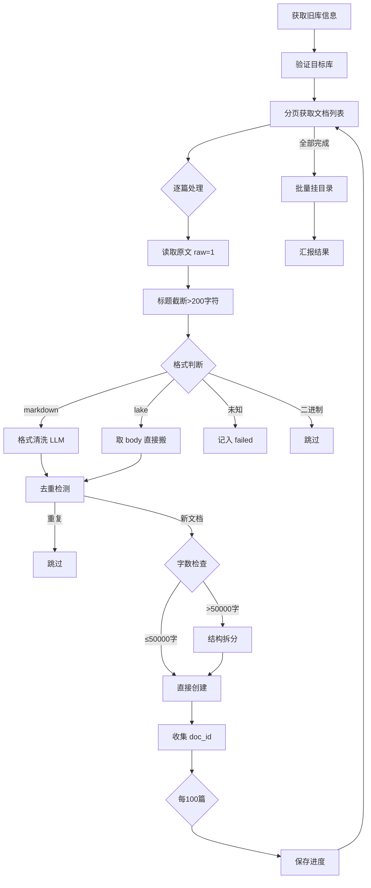

# 语雀知识库迁移 Skill

> 将语雀知识库内容复制整理到另一个知识库 —— 清洗格式、去重、拆大文档、批量挂目录、断点续传。

**核心理念：复制不搬。原库完全不动，目标库接收清洗后的内容。**

**作者：[yehuoshun](https://github.com/yehuoshun)**

---

## 安装

### 方式一：下载 SKILL.md（推荐）

从 [Releases](https://github.com/yehuoshun/yuque-migration-skill/releases/latest) 下载 `SKILL.md`，放入你使用的 AI Agent 框架的 skills 目录即可。

支持：OpenClaw / Claude Code / Codex / Cursor / Copilot Chat 等任意支持 Markdown skill 的 LLM 工作流。

### 方式二：Git Clone

```bash
git clone https://github.com/yehuoshun/yuque-migration-skill.git
```

## 前置条件

1. 已在语雀创建源知识库和目标知识库
2. 已获取语雀 API Token（[语雀开放平台](https://www.yuque.com/settings/tokens) 创建），配置为环境变量或写入配置文件

## 快速开始

在 AI 对话中直接说：

```
将《我的笔记》内容整理到《归档库》
```

中断后继续：

```
继续整理《我的笔记》
```

---

## 工具脚本

| 脚本 | 说明 |
|------|------|
| `scripts/migrate.py` | 通用迁移脚本，支持断点续传、LLM 清洗、自动分类建目录 |
| `scripts/retry_failed.py` | 重试失败文档导入 |
| `scripts/migrate_batch.py` | 旧版批量迁移脚本（不再维护） |

---

## 功能特性

| 功能 | 说明 |
|------|------|
| 🔄 **跨库复制** | 将源知识库的全部文档复制到目标知识库，源库毫发无伤 |
| 🧹 **格式清洗** | LLM 驱动的文档清洗：去广告、清 HTML 残留、修复 Markdown 格式。SQL/JSON/代码文件等非文档内容自动跳过清洗 |
| 🔍 **智能去重** | 按标题搜索 → 逐级内容比对 → 自动跳过重复文档 |
| ✏️ **标题处理** | 自动截断超长标题（>200 字符）避免 API 422 错误（官方文档写 255 是错的） |
| ✂️ **大文档拆分** | >50000 字（约 200KB）的文档自动按结构拆分，代码块安全切分（不在代码块内切割） |
| 🗑️ **二进制过滤** | 内容采样自动检测并跳过二进制文件（图片/压缩包等） |
| 📂 **自动分类挂目录** | LLM 基于文档内容自动聚类，构建 TOC 目录批量挂载 |
| 💾 **断点续传** | 进度文件持久化，中断后精确接续 |
| 🏷️ **格式兼容** | 支持 Markdown 清洗 + Lake 格式无损搬运 |
| 🚦 **限流保护** | 自动检测 Rate Limit，触发限流后保存进度等恢复 |
| 📊 **容量检查** | 目标库达 4500 篇触发切换阈值，自动暂停 |

---

## 迁移流程



---

## 文档格式处理

### Markdown 格式
完整走清洗流程：去广告、清 HTML 残留、修复断裂格式、保留技术内容。

**清洗优化**：SQL dump、JSON 数组、纯代码文件等非文档内容自动跳过 LLM 清洗，仅做表格格式修复，节省时间和 API 调用。

### Lake 格式
语雀新版编辑器格式。取 `body_lake` 字段（原生格式），以 `format: "lake"` 创建到目标库，不做格式清洗、不去重。标题保持不变，附件链接原样保留。

### 标题处理
语雀 API 标题长度上限 200 字符（官方文档写 255 是错的，实测报 `长度要求小于 200`），超长自动截断加 `...`，避免 422 错误。

### 二进制文件
内容采样检测（非 ASCII + 控制字符 > 25%），判定为二进制则直接跳过。

### 未知格式
记入失败列表，不阻塞整体流程。

---

## API 接口

基地址：`https://www.yuque.com/api/v2`

| 操作 | 方法 | 路径 |
|------|------|------|
| 获取知识库列表 | `GET` | `/users/{login}/repos` |
| 获取知识库详情 | `GET` | `/repos/{book_id}` |
| 分页获取文档 | `GET` | `/repos/{book_id}/docs?offset={N}&limit=100` |
| 读取文档原文 | `GET` | `/repos/{book_id}/docs/{doc_id}?raw=1` |
| 搜索文档 | `GET` | `/search?q={title}&type=doc&scope={namespace}` |
| 创建文档 | `POST` | `/repos/{book_id}/docs` |
| 创建目录节点 | `PUT` | `/repos/{book_id}/toc` |

---

## 限流与容错

### Rate Limit
- **5000 次/小时** → 触发后保存进度，等整点恢复
- **100 次/秒** → 等 1s 重试，最多 3 次

### 错误重试
- 网络超时 / 5xx / 4xx（非 404）→ 等 1s 重试，最多 3 次
- 404 → 直接跳过
- 3 次全部失败 → 记入 `failed`

### 并发控制
- 同时处理 ≤ 5 篇文档
- 累计正文 > 5MB → 暂停新请求
- 单篇 > 10 万字 → 串行处理

---

## 进度文件

中断后自动保存，续传时从断点恢复。每处理完一篇文档立即保存。

```json
{
  "source_book_id": 123,
  "target_book_id": 456,
  "last_offset": 150,
  "total_docs": 300,
  "created": 280,
  "skipped": 10,
  "failed": 5,
  "failed_list": [
    {"id": 999, "title": "xxx", "reason": "未知格式: pdf"}
  ],
  "orphans": [
    {"doc_id": 888, "title": "yyy", "errors": ["TOC挂载失败"]}
  ],
  "lake_docs": [
    {"doc_id": 555, "new_id": 666, "title": "xxx", "reason": "lake 格式无损搬运"}
  ],
  "target_history": [
    {"book_id": 111, "book_name": "目标库A", "doc_count": 4500}
  ]
}
```

---

## 迁移报告示例

```
📦 《我的笔记》(5200篇) → 目标库/
   ├─ 复制: 5145 篇（成功创建，含拆分后的子文档）
   ├─ 跳过: 0 篇（去重）50 篇（空文档）0 篇（二进制）
   ├─ 大文档: 23 篇（已拆分）
   ├─ 含附件文档: 12 篇（清单，附件无法迁移，请手动处理）
   ├─ Lake 无损搬运: 8 篇（原生格式，表格/样式完整保留）
   ├─ 失败: 5 篇（清单，列出原因）
   ├─ 孤儿文档: 3 篇（已创建但未挂目录，需手动处理）
   ├─ 目标库用量:
   │    目标库A: 4500/5000（已切换）
   │    目标库B: 350/5000（当前）
   └─ 原库: 未动
```

---

## 不做什么

- ❌ 不删除原库任何内容
- ❌ 不迁移附件（API 不支持，列清单）
- ❌ 不建立分类库
- ❌ 不构建索引
- ❌ 不将源库分散到多个目标库
- ❌ 不同时运行多个迁移任务（防止触发 API 高并发限制）

---

## ⚠️ 免责声明

本工具按「原样」提供，使用即视为同意以下条款：

- 源库**只复制不搬移**，不会删除源库任何内容
- 迁移可能导致文档拆分、标题去重更名、格式变化；附件**不支持迁移**
- 语雀 API 有严格限流和单库 5000 篇上限，大库迁移耗时较长
- 格式清洗依赖 LLM，小概率漏清或误删，建议**先测试库验证**再正式迁移
- 作者对使用本工具导致的文档错乱、数据丢失、知识库混乱等**不承担责任**

## License

MIT
